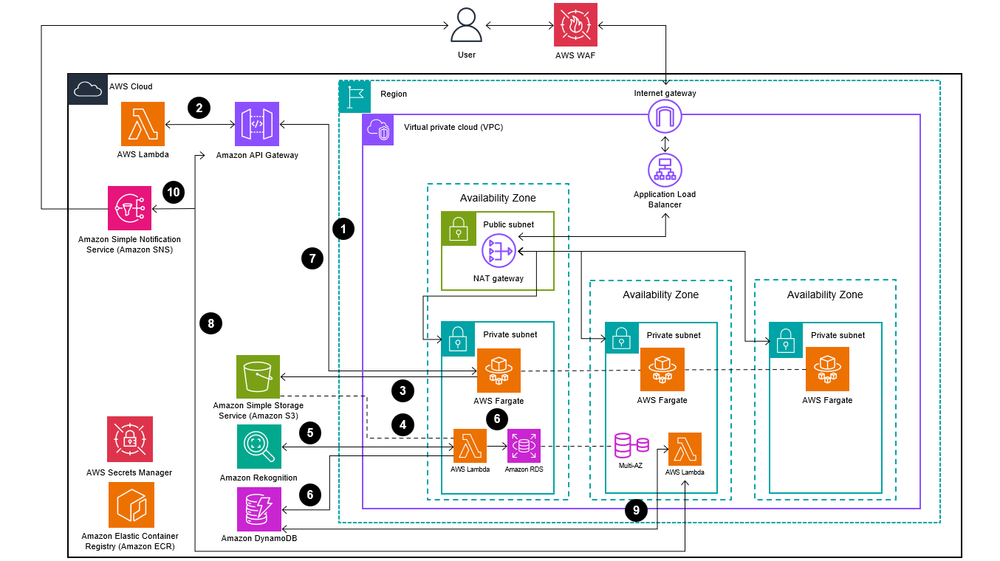

# 🚀 README - Arquitetura AWS para Processamento de Imagens 🌄

## 🌐 Visão Geral
Esta arquitetura AWS permite o **upload**, **processamento** e **análise** de imagens utilizando vários serviços da AWS. O sistema detecta automaticamente se uma imagem contém pessoas usando Amazon Rekognition e armazena os resultados.

## 🧩 Componentes da Arquitetura

### 🔧 Principais Serviços AWS Utilizados
1. **🛳️ AWS Fargate** - Hospeda o frontend da aplicação
2. **🗄️ Amazon S3** - Armazena as imagens enviadas pelos usuários
3. **⚡ AWS Lambda** - Executa funções serverless para processamento
4. **👁️ Amazon Rekognition** - Serviço de análise de imagens (detecta pessoas)
5. **📊 Amazon DynamoDB** - Armazena metadados das imagens
6. **🐬 Amazon RDS (MySQL)** - Banco de dados para resultados completos
7. **📨 Amazon SNS** - Serviço de notificações
8. **🔑 API Gateway** - Gerencia a API da aplicação

### 🛡️ Infraestrutura de Rede
- **☁️ VPC** - Rede privada virtual
- **🔒 Subnets Públicas/Privadas** 
- **⚖️ Application Load Balancer**
- **🌐 Internet Gateway**
- **🔥 WAF- Firewall**

## 🔄 Fluxo de Processamento
  

1. Usuário faz upload da imagem no front (hospedado no Fargate). Front faz requisição de nova URL para upload da imagem no S3 (API Gateway, Lambda)

2. API retorna URL única da nova imagem a ser inserida no S3

3. Front utiliza a URL para salvar a imagem no S3

4. S3 dispara um evento pela criação da nova imagem e aciona uma função Lambda

5. Lambda processa a imagem no Rekognition e obtém as labels

6. Lambda salva resultado do processamento no MySQL RDS e salva metadados da imagem no DynamoDB

7. Front faz um post com o id da imagem (gerado na primeira etapa) para a API

8. API redireciona a requisição para outra função Lambda, com o objetivo de retornar para o front se a imagem processada tem uma pessoa ou não

9. Realiza uma consulta no DynamoDB, retornando para o front e redirecionando para página de resultados

10. Envia dados do processamento para um tópico do SNS

## 🔒 Considerações de Segurança
- 🛡️ Secrets Manager para credenciais
- 🏠 Comunicação interna via VPC
- 🚫 Acesso restrito ao RDS e funções Lambda que manipulam o DB

---

✨ **Arquitetura serverless escalável para análise de imagens na AWS!** ✨

---

**Integrantes:**
1. Gabriel Faria e Silva
2. Guilherme Canarini Kaneda 
3. João Pedro Vetorazzo Arantes
4. Júlio Figueiredo
5. Luiz Otávio Teles